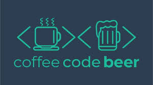
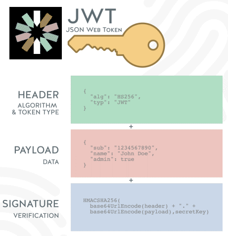

# node-jest-tdd
node-jest-tdd por Rocketseat

<h1 align="center">
    
</h1>

<h1 align="center">
    
</h1>

<h4 align="center">
  ☕ Coffee, code and beer
</h4>
<p align="center">
    
</p>

<p align="center">
  <a href="#tecnologias">Tecnologias</a>&nbsp;&nbsp;&nbsp;|&nbsp;&nbsp;&nbsp;
  <a href="#-projeto">Projeto</a>&nbsp;&nbsp;&nbsp;|&nbsp;&nbsp;&nbsp;
  <a href="#-layout">Layout</a>&nbsp;&nbsp;&nbsp;|&nbsp;&nbsp;&nbsp;
  <a href="#-como-contribuir">Como contribuir</a>&nbsp;&nbsp;&nbsp;|&nbsp;&nbsp;&nbsp;
  <a href="#memo-licença">Licença</a>
</p>

<br>

<p align="center">
  
</p>

## Tecnologias

Esse projeto foi desenvolvido com as seguintes tecnologias:

- [Jest](https://jestjs.io/)
- [Node.js](https://nodejs.org/en/)
- [React](https://reactjs.org)
- [Sequelize](https://sequelize.org/)


## 💻 Projeto
O projeto note-jest-tdd visa demonstar a utilização do framework jest para o desenvolvimento orientado a testes (TDD). No projeto são integrados as seguintes funcionalidades:

- Criação de variáveis de ambiente via dotent (.env) 
- Criação de estrutura de dados via sequelize (migrators)
- Criação de rotas de testes e de serviços (supertest)
- Criação de sessões de usuário (sessions)
- Criação de tokens para controle de sessão (JWT json web token)
- Criação de criptografia de dados para encapsular senhas (bcryptjs)
- Criação de testes unitários e testes de integração
- Criação de massas de testes (factory-girl and faker)

## 🔖 Layout

Você pode baixar o projeto direto do site https://github.com/Rocketseat/youtube-nodejs-tdd-jest/blob/master/src/app/middleware/auth.js

O passo a passo do projeto poderá ser acessado através do youtube https://www.youtube.com/watch?v=2G_mWfG0DZE

## 🤔 Como contribuir

- Faça um fork desse repositório;
- Cria uma branch com a sua feature: `git checkout -b minha-feature`;
- Faça commit das suas alterações: `git commit -m 'feat: Minha nova feature'`;
- Faça push para a sua branch: `git push origin minha-feature`.

Depois que o merge da sua pull request for feito, você pode deletar a sua branch.

## Obtendo a configuração da base de dados
`yarn` instalará todas as dependências necessária do Node.

Você precisá ter o Docker instalado e configurado no seu ambiente para rodar a aplicação. Após isso, basta criar o container do Postgres no Docker, rodando os seguintes comandos:

```sh
docker run -p 5432:5432 -d \
--name postgresql \
-e POSTGRES_PASSWORD=docker \
-e POSTGRES_USER=docker \
-e POSTGRES_DB=nodeauth \
-v pgdata:/var/lib/postgresql/data \
postgres

Isso criará no Docker uma instância no volume pgdata, rodando Postgres com o usuário "docker" e a senha "docker". Isso também criará uma base de dados chamada nodeauth permitindo que o usuário tenha permissão completa.
```

## :memo: Licença

Esse projeto está sob a licença MIT. Veja o arquivo [LICENSE](LICENSE.md) para mais detalhes.

---
